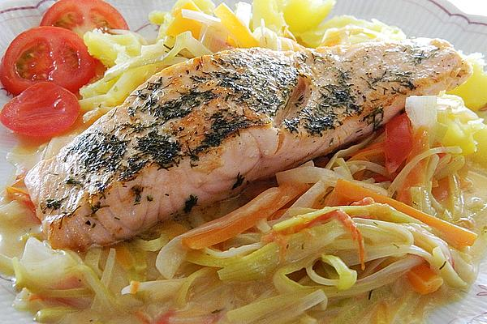

# Lachsfilet El Salomo

## Zutaten für 3 Personen
* ¾ kg	Lachsfilet(s), ohne Haut 
* 263 g	Möhre(n) 
* 263 g	Tomate(n)
* ¾ Bund	Dill
* 1 ½ EL	Weinbrand
* ¾	Zitrone(n)
* 45 g	Butter
* 18 ¾ g	Mehl
* 300 ml	Fischfond
* 150 g	Sahne
* etwas	Salz
* etwas	Pfeffer 

## Zubereitung

1. Möhren und Porree putzen, waschen und in feine Stifte schneiden. Tomaten waschen, vierteln und die Kerne entfernen. Tomatenviertel der Länge nach in dünne Spalten schneiden.
2. Dill waschen und, bis auf etwas zum Garnieren, fein schneiden. Die Hälfte des Gemüses in eine längliche Form geben.
Eine Lachsfiletseite mit einem Esslöffel Weinbrand und zwei Esslöffeln Zitronensaft beträufeln. Mit der Hälfte des Dills bestreuen und mit dieser Seite nach unten auf das Gemüse legen.
3. Nun die andere Filetseite ebenfalls beträufeln und mit dem restlichen Dill bestreuen. Übriges Gemüse darauf verteilen und mit Frischhaltefolie zudecken. Über Nacht im Kühlschrank stehen lassen.

4. Lachsfilet aus dem Gemüsebett heben und in sechs bis acht Tranchen schneiden.
30 Gramm Butter in einer großen Pfanne erhitzen, Lachstranchen hineinlegen und unter Wenden fünf bis sechs Minuten braten. Mit Salz und Pfeffer würzen.

5. Gemüse und Soße auf eine tiefe Platte geben und den Lachs darauf anrichten. Mit Zitrone und Dill garniert servieren. Dazu schmecken Salzkartoffeln.