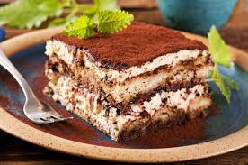

# TIRAMISU

***Zutaten:***

- 500 g         Mascarpone
- 4             Eigelb
- 2             Eiweiß
- 4 EL          Zucker
- 300 g         Löffelbiskuit
- 1 Tasse       starker Kaffee
- 1 Gläschen    Schnaps

***Zubereitung:***

Das Eigelb mit dem Zucker schaumig schlagen, Mascarpone gut untermischen. Eiweiß zu Schnee schlagen.

Den Schnaps mit dem Kaffee vermischen. Die Löffelbiskuit darin wenden und abwechselnd mit der Mascarpone-Mischung in eine flache Form schichten. Dabei mit einer Schicht Löffelbiskuit beginnen und mit einer Mascarpone-Schicht abschließen. Das Ganze etwa 2 Stunden in den Kühlschrank stellen. Kurz vor dem Servieren dick mit Kakaopulver übersieben.

*Und dann schmecken lassen! Mmmmh...*

