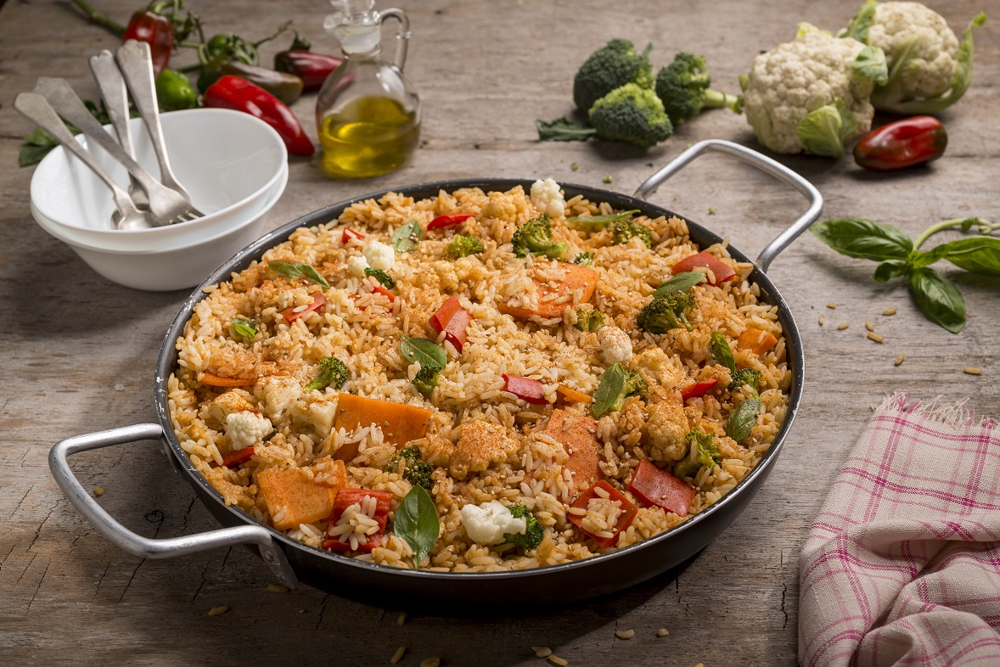

# VEGETARISCHE PAELLA

Ob klassisch mit Fleisch, als *"Paella marisco"* mit Meeresfrüchten oder als "Paella mixta" mit beidem – das spanische Reisgericht hat eine lange Tradition. ***Mit unserem Gemüse-Paella-Rezept***  (  [Link zur Webseite](https://www.edeka.de/rezepte/rezept/vegetarische-paella.jsp) )können auch ***Vegetarier*** das würzige Gericht genießen.

## Zutaten:
	- 170 g Bohnen, grün
	- 100 g Paprika, rot
	- 100 g Paprika, gelb
	- 170 g Zucchini
	- 170 Augergine
	- 130 g Gemüsezwibel
	- 1 Knoblauchzehe
	- 2/3 Liter Gemüsebrühe
	- 4 EL Olivenöl, nativ extra
	- 1 Dose Safranfaden
	- 270 g Tomate
	- 1 Dose Kichererbse (240g)
	- 300 g Paella-Reis
	- 1 TL Paprikapulver, edelsüß
	- 1/2 TL Koriander, gemahlen
	- Salz
	- 1 kleine Peperoni, rot
	- 1 EL Petersilie, fein geschnitten
	- Thymian
	
	
## Zubereitung:

	1. Die Bohnen von den Enden befreien, evtl. vorhandene Fäden abziehen, dann leicht schräg in 3 cm lange Stücke schneiden. Paprikaschoten vierteln, Stielansätze, Samen und die weißen Trennwände entfernen, das Fruchtfleisch in 3cm große Stücke schneiden. Zucchini und Aubergine von Blüten- und Stielansatz befreien, quer in 1 cm dicke Scheiben schneiden und diese dann vierteln. Zwiebeln und Knoblauch schälen und fein hacken.
	2. Gemüsebrühe in einem Topf aufkochen, die Bohnen darin in etwa 8 Minuten bissfest garen. Mit dem Schaumlöffel herausheben, in einem Sieb kurz kalt abschrecken und abtropfen lassen. Den Safran zwischen den Fingern zerreiben und in der heißen Gemüsebrühe  
	3. Reis mit der Brühe mischen, mit Paprikapulver, Koriander und Salz würzen und etwa 1 Minute kochen lassen.
	4. In einer Pfanne die Hälfte des Öls erhitzen, Zwiebeln und Knoblauch zufügen und anschwitzen. Paprika, Zucchini und Aubergine zufügen, 5 Minuten mitbraten und vom Herd ziehen.
	5. Tomaten kurz blanchieren, kalt abschrecken, häuten, halbieren, Stielansätze und Samen entfernen – letztere durch ein Sieb passieren, den entstanden Saft beiseite stellen, das Fruchtfleisch in kleine Würfel schneiden. Kichererbsen in ein Sieb schütten und gründlich kalt abbrausen, abtropfen lassen.
	6. Den Backofen auf 180 Grad Ober-/Unterhitze (Umluft 160 Grad) vorheizen.
	7. In einer Paella-Pfanne das Gemüse, gewürfelte Tomaten, Tomatensaft, Gemüsebrühe mit Reis und Kichererbsen mischen. Peperoni vom Stielansatz befreien, klein hacken und dabei die Samen entfernen. Petersilie und Peperoni einstreuen und untermengen. Mit dem restlichen Öl die Paella beträufeln und mit Alufolie bedecken.
	8. Im vorgeheizten Ofen auf der unteren Schiene ca. 20 Minuten backen. Dann die Folie entfernen und weitere 10 Minuten garen, bis der Reis bissfest und die Oberfläche leicht gebräunt ist.
	9. Mit frischem Thymian bestreut servieren. 

#####  Entdecken Sie weitere Paella-Rezepte und vegetarische Rezepte wie zum Beispiel unseren Paprikasalat mit grünen Bohnen...[Klicken Sie hier](https://www.edeka.de/rezepte/suche.jsp) 

